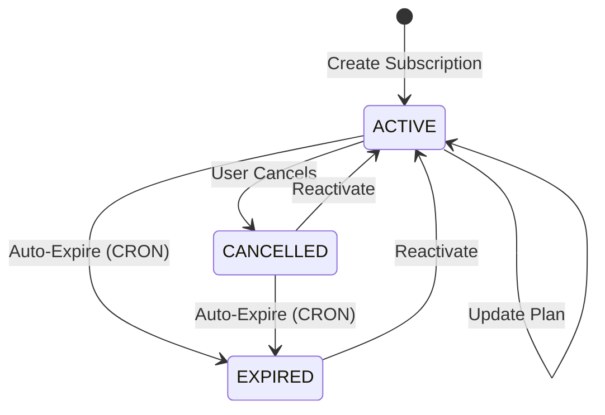

# Subscription Management System

A robust microservice for managing user subscriptions in a SaaS platform with automated workflows, email notifications, and scalable architecture.

## Table of Contents
- [Overview](#overview)
- [Architecture](#architecture)
- [Tech Stack](#tech-stack)
- [Getting Started](#getting-started)
- [Core Features](#core-features)
- [API Reference](#api-reference)
- [Subscription State Management](#subscription-state-management)
- [System Workflows](#system-workflows)
- [Security](#security)
- [Contributing](#contributing)

## Overview

This microservice handles complete subscription lifecycle management including user authentication, plan management, automated expiration handling, and email notifications through a message queue system.

### Key Capabilities
- JWT-based user authentication with secure password handling
- Complete subscription lifecycle (create, update, cancel, reactivate, auto-expire)
- Automated email notifications with HTML templates and queue processing
- Redis-based caching and FIFO message queue
- CRON-based automatic subscription expiration
- Comprehensive subscription history and analytics

## Architecture

The system follows Clean Architecture principles with clear separation of concerns:

```
┌─────────────────┬─────────────────┬─────────────────┐
│   Controllers   │    Services     │   Repository    │
│                 │                 │                 │
│ • HTTP handlers │ • Business      │ • MongoDB ops   │
│ • Validation    │   logic         │ • Redis cache   │
│ • Auth checks   │ • Workflows     │ • Data models   │
└─────────────────┴─────────────────┴─────────────────┘
                           │
                  ┌────────────────┐
                  │ Infrastructure │
                  │                │
                  │ • Message Queue│
                  │ • Email Service│
                  │ • CRON Jobs    │
                  │ • External APIs│
                  └────────────────┘
```

### Layer Responsibilities
- **Controllers**: Handle HTTP requests, input validation (Zod), JWT authentication, error responses
- **Services**: Implement business logic, subscription workflows, plan management, email coordination
- **Repository**: Database operations (MongoDB/Mongoose), Redis caching, data model management
- **Infrastructure**: Message queue, email service integration, CRON scheduling, external service clients

## Tech Stack

| Component | Technology | Purpose |
|-----------|------------|---------|
| **Runtime** | Node.js + Express | API server and routing |
| **Database** | MongoDB + Mongoose | Primary data storage with ODM |
| **Cache/Queue** | Redis (Upstash) | Caching and FIFO message queue |
| **Authentication** | JWT | Stateless user authentication |
| **Email** | Cloudflare Worker + Resend | Reliable email delivery |
| **Validation** | Zod | Runtime input validation |
| **Scheduling** | node-cron | Automated subscription expiration |

## Getting Started

### Prerequisites
- Node.js (v14+)
- MongoDB instance
- Redis/Upstash account
- Resend API account
- Cloudflare Worker account

### Installation

1. **Clone and setup**
   ```bash
   git clone <repository-url>
   cd subscription-service
   npm install
   ```

2. **Environment Configuration**
   Create `.env` file:
   ```env
   # Database
   MONGODB_URI=mongodb://localhost:27017/subscription-service
   
   # Authentication
   JWT_SECRET=your-jwt-secret-key
   JWT_EXPIRY=24h
   
   # Redis (Upstash)
   UPSTASH_REDIS_REST_URL=your-upstash-redis-url
   UPSTASH_REDIS_REST_TOKEN=your-upstash-redis-token
   
   # Email Service
   RESEND_API_KEY=your-resend-api-key
   
   # Server
   PORT=3000
   ```

3. **Start the service**
   ```bash
   # Development
   npm run dev
   
   # Production
   npm start
   ```

## Core Features

### Authentication System
- **JWT-based authentication** with secure token generation and validation
- **Password security** using bcrypt hashing
- **Protected routes** with middleware authentication
- **Token expiration** handling with configurable expiry

### Subscription Management
- **Full lifecycle management**: Create → Active → Update/Cancel → Expire → Reactivate
- **Automatic expiration**: CRON job checks every 30 seconds for expired subscriptions
- **History tracking**: Complete audit trail of all subscription changes
- **Plan flexibility**: Upgrades, downgrades, and plan switching support

### Email Notification System
- **FIFO message queue** using Redis for ordered email processing
- **Asynchronous processing** with retry mechanism (up to 3 attempts)
- **Beautiful HTML templates** with responsive design
- **Event-driven notifications** for signup, subscription changes, expiration

### Performance Features
- **Redis caching** for plan data to improve response times
- **Queue-based email processing** to prevent API blocking
- **Optimized database queries** with proper indexing
- **Error handling** with comprehensive logging

## API Reference

### Authentication Endpoints

#### Register User
```http
POST /api/auth/signup
Content-Type: application/json

{
  "name": "John Doe",
  "email": "john@example.com",
  "password": "securepassword"
}
```

**Response:**
```json
{
  "success": true,
  "message": "User created successfully",
  "data": {
    "token": "jwt-token",
    "user": {
      "id": "user-id",
      "name": "John Doe",
      "email": "john@example.com"
    }
  }
}
```

#### Login
```http
POST /api/auth/login
Content-Type: application/json

{
  "email": "john@example.com",
  "password": "securepassword"
}
```

### Subscription Endpoints

#### Create Subscription
```http
POST /api/subscriptions/:userId
Authorization: Bearer <jwt-token>
Content-Type: application/json

{
  "planId": "plan-id"
}
```

#### Get Subscription History
```http
GET /api/subscriptions/:userId
Authorization: Bearer <jwt-token>
```

**Response includes:**
- Current active subscription
- Complete history grouped by status (active, expired, cancelled)
- Total subscription count
- Chronologically sorted subscription list

#### Update Subscription Plan
```http
PUT /api/subscriptions/:userId
Authorization: Bearer <jwt-token>
Content-Type: application/json

{
  "planId": "new-plan-id"
}
```

#### Cancel Subscription
```http
DELETE /api/subscriptions/:userId
Authorization: Bearer <jwt-token>
```

#### Reactivate Subscription
```http
POST /api/subscriptions/:userId/reactivate
Authorization: Bearer <jwt-token>
Content-Type: application/json

{
  "planId": "plan-id"
}
```

### Plan Management

#### Get All Plans
```http
GET /api/plans
```

Returns cached plan data including pricing, features, and duration information.

## Subscription State Management

### States and Transitions



### State Definitions

| State | Description | Triggers | User Access |
|-------|-------------|----------|-------------|
| **ACTIVE** | Subscription is valid and current | New subscription, reactivation, plan update | Full access |
| **CANCELLED** | User cancelled but still has access until end date | Manual cancellation via DELETE endpoint | Access until end_date |
| **EXPIRED** | Subscription has passed end date | CRON job auto-expiration | No access |

### State Management Rules

1. **ACTIVE Subscriptions**
   - Can be updated to different plans
   - Can be cancelled (becomes CANCELLED)
   - Auto-expire when end_date reached

2. **CANCELLED Subscriptions**
   - Maintain access until original end_date
   - Cannot be updated (must reactivate first)
   - Auto-expire to EXPIRED when end_date reached

3. **EXPIRED Subscriptions**
   - No service access
   - Can be reactivated with new plan
   - Can create entirely new subscription

## System Workflows

### User Registration Flow
1. User submits registration → Validate input → Hash password → Save to database
2. Generate JWT token → Add welcome email to queue → Return success response
3. Queue processes email → Send via Cloudflare Worker → Update email status

### Subscription Creation Flow
1. Validate user and plan → Check for existing active subscription
2. Create subscription record → Calculate end_date based on plan duration
3. Add confirmation email to queue → Return subscription details
4. Process email notification asynchronously

### Automatic Expiration Flow (CRON Job - Every 30 seconds)
1. Query for subscriptions where `end_date <= current_time` and `status IN ['ACTIVE', 'CANCELLED']`
2. Update status to 'EXPIRED' → Add expiration email to queue
3. Log expiration events → Update user access permissions

### Email Queue Processing
1. Redis FIFO queue ensures ordered processing
2. Worker picks up jobs → Sends via Cloudflare Worker + Resend API
3. Retry failed jobs (max 3 attempts) → Log final status
4. Queue continues processing remaining jobs

## Security

### Authentication & Authorization
- **JWT tokens** with configurable expiration
- **Password hashing** using bcrypt with salt rounds
- **Route protection** middleware for all subscription endpoints
- **Input validation** using Zod schemas for all endpoints

### Data Protection
- **Environment variable** configuration for sensitive data
- **HTTPS enforcement** for all API communications
- **Error message sanitization** to prevent information leakage
- **Database connection security** with proper MongoDB authentication

### Security Best Practices
- No sensitive data in error responses
- Proper HTTP status codes for different scenarios
- Async error handling to prevent crashes
- Input sanitization and validation at all entry points

## Contributing

### Development Workflow
1. Fork repository → Create feature branch → Implement changes
2. Follow coding standards → Add tests → Update documentation
3. Submit pull request → Code review → Merge to main

### Code Quality Standards
- **Modular architecture** with clear separation of concerns
- **Consistent formatting** and naming conventions
- **Comprehensive error handling** with proper logging
- **Input validation** for all external inputs
- **Documentation** for all public APIs and complex logic

### Testing Guidelines
- Unit tests for business logic
- Integration tests for API endpoints
- Mock external services (Redis, MongoDB, Email)
- Test error scenarios and edge cases

---

## License

MIT License - see LICENSE file for details.